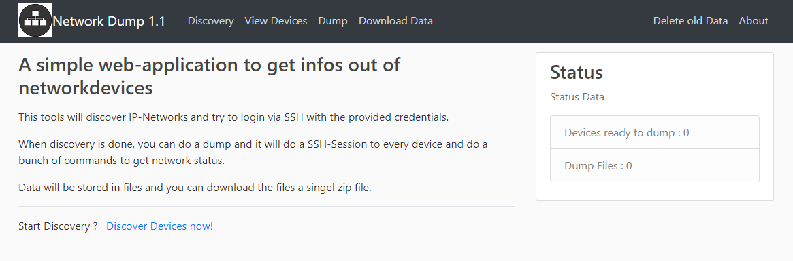
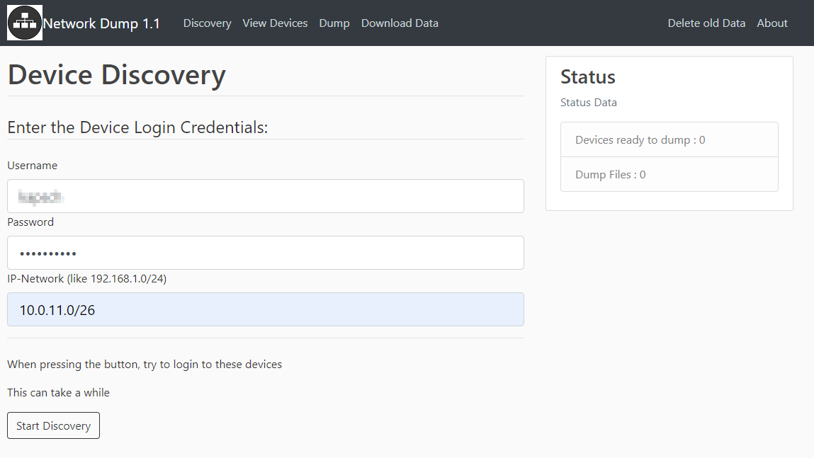
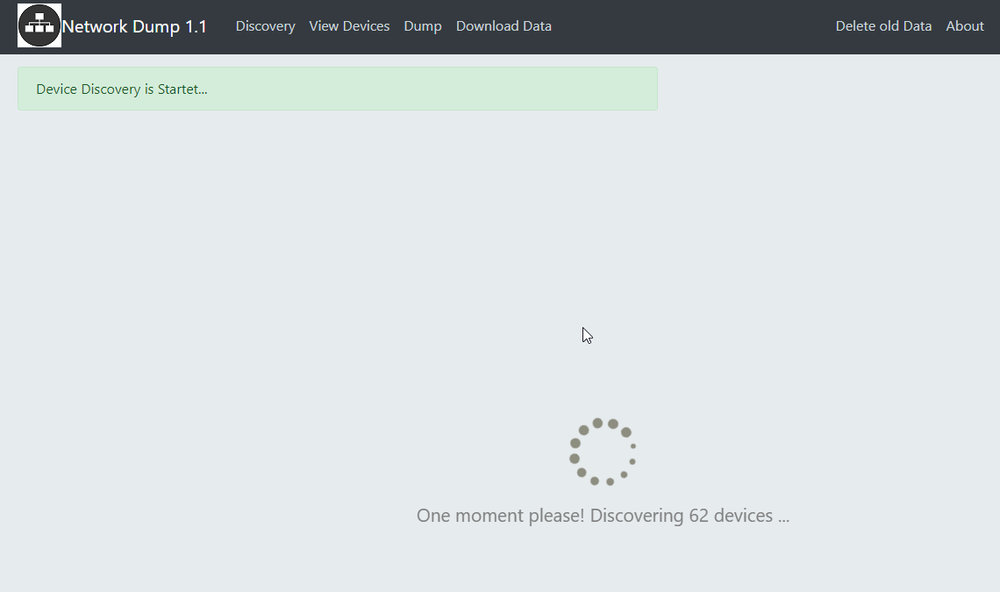
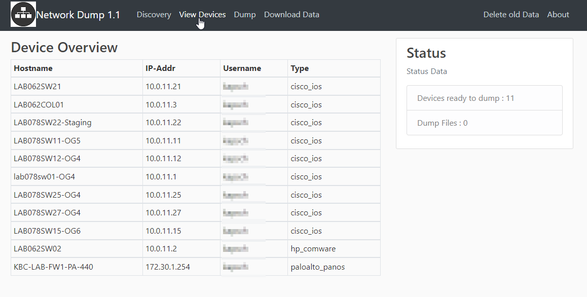
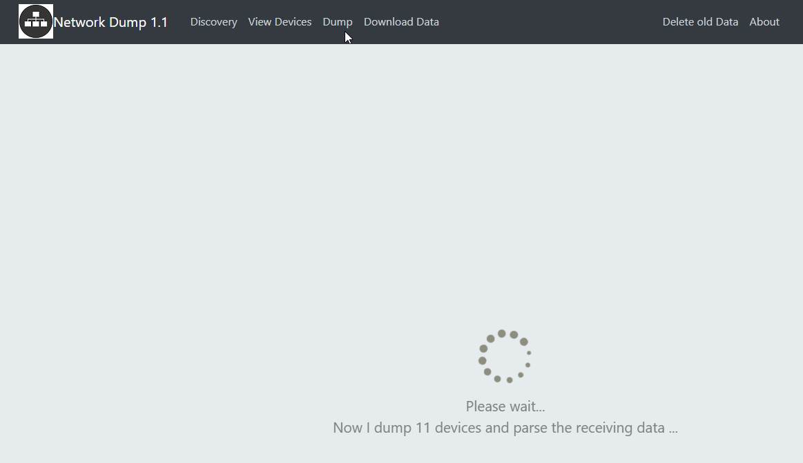
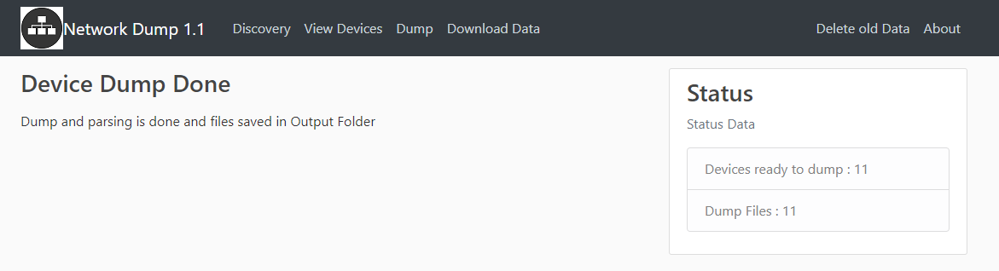
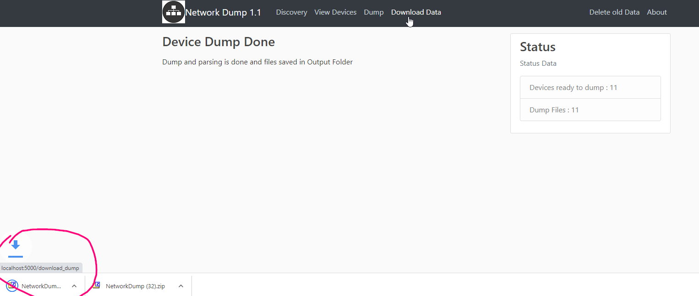
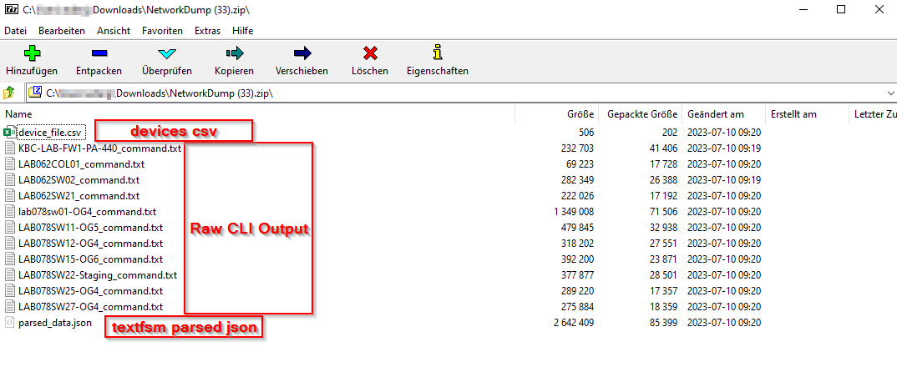

# WebNetworkDump
This should help networkengineers for giving an overview of new networks. It will ask for IP-Network to do a discovery. It will try to login via SSH and find the devicetype.

Then it will login and execute a buntch of "show-commands" depending on devicetype. The ouput will be parsed and Raw-Datafiles and pared json file will be generated. Commands which will be executed can be modified in "get_dumps.py" file. 

This dump files and parsed files can be downloaded and used for deeper analysis.

I tested with Cisco IOS, IOS-XE, NX-OS, HP-Comware and Paloalto Firewalls.

If devicetype is discovered by netmiko and no commands where defined, it will use the commands where NTC-Templates has parser for.
see: https://github.com/networktocode/ntc-templates/blob/master/ntc_templates/templates/index


## Easystart with DockerContainer on local maschine!

- Get Container from Dockerhub
  - ```docker run -p 5000:5000 -p 8888:8888 edergernot/webnetworkdump```

- Start dumping the Network and browse to:
  - ```http://localhost:5000```

Just add devicecredentials to SSH into device and discovery-network.

## Working with webnetworkdump

Index


Discovery


Discovery Process


DeviceView


Dump


DumpDone


Download


Dumpfile



### Quickinstall with UV
```
git clone https://github.com/edergernot/WebNetworkDump1.1
cd WebNetworkDump1.1
```

### Install UV packetmanger
Powershell
```
powershell -ExecutionPolicy ByPass -c "irm https://astral.sh/uv/install.ps1 | iex"
```
WSL or Git Bash
```
curl -LsSf https://astral.sh/uv/install.sh |sh
```
### Create Virtual Environment
```
uv venv --python 3.11
.venv\Scripts\activate
uv pip install -r requirements.txt
```
### Run App
```
python webnetworkdump.py
```

